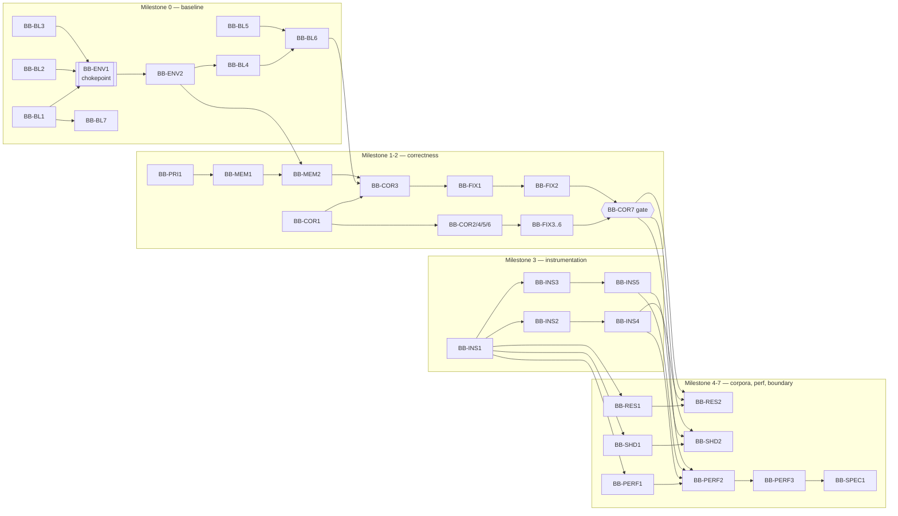

# Bloodborne on shadPS4 correctness + instrumentation

## Goal

Довести Bloodborne на shadPS4 до состояния, в котором correctness достаточно надёжен для profiling, CPU/GPU/memory paths наблюдаемы, baseline/corpora воспроизводимы, реальные bottlenecks измерены, а граница между generic shadPS4 work и Bloodborne-specific specialization определяется evidence.

На этом этапе **не делать отдельный Bloodborne runtime и не оптимизировать игру за счёт неподтверждённых title-specific assumptions**. Минимальные title-specific эксперименты допустимы только для проверки гипотез.

### Named goals and traceability

Каждый item существует ради одной из этих целей. Item, не отнесённый ни к одной цели, — кандидат на удаление; цель без ready-now item — видимый planning defect.

| Goal | Формулировка | Первичные items | Success metric |
| --- | --- | --- | --- |
| **G1** | Установить и устранить причину роста памяти (host RAM / VRAM / guest-visible) в Bloodborne | BB-MEM1, BB-MEM2, BB-COR3, BB-FIX1, BB-FIX2 | см. `SM-1` |
| **G2** | Измерить реальные bottlenecks и ранжировать optimization opportunities | BB-PERF1, BB-PERF2, BB-PERF3 | см. `SM-2` |
| **G3** | Определить границу generic shadPS4 work ↔ Bloodborne specialization по evidence | BB-COR7, BB-SPEC1 | см. `SM-3` |

**Этот этап не содержит items, реализующих оптимизации.** Он заканчивается измеренным bottleneck map и решением о границе specialization (**BB-SPEC1**). Собственно performance-фиксы — следующий этап; см. [Out of scope / next stage](#out-of-scope--next-stage). Это осознанный tradeoff: без **G1** и корректного baseline любой перф-фикс ранжирует стоимость emulator defects как optimization opportunity.

## Roadmap navigation

Производная проекция графа. При расхождении с телами items выигрывают тела items.

Структура этого документа — разделы `Status vocabulary`, `Item sizing and slice budget`, `Operator cost`, `Operator budget`, `Success metrics`, `Risks and kill criteria`, `Out of scope / next stage` и items **BB-PRI1**, **BB-MEM1**, **BB-MEM2**, **BB-ENV2**, **BB-BL7**, **BB-INS5** — результат [ревью роадмапа от 2026-08-25](./docs/reviews/roadmap-review-2026-08.md). Ревью не является evidence; его выводы вошли в реальность только через items и правила ниже.

**Ready now (все зависимости closed, нет активного PR):** **BB-PRI1**, **BB-MEM1**, **BB-BL7**, **BB-INS2**, **BB-INS3**, **BB-RES1**, **BB-PERF1**, **BB-SHD1** — 8 из 40 items.

**Единственная точка входа на таргет — BB-ENV1.** Она транзитивно гейтит 25 из 40 items, и через неё проходят все 16 GATED items. Пока **BB-ENV1** не имеет ни одного bounded target-machine run record, ни одна цель не может быть достигнута, сколько бы cloud-работы ни было выполнено. Приоритет **BB-ENV1** выше любого CLOUD RESEARCH item в этом документе.

**Критические пути:**

- **G1 (память):** `BB-PRI1 → BB-MEM1 → BB-ENV1 → BB-ENV2 → BB-MEM2 → BB-COR3 → BB-FIX1 → BB-FIX2`
- **G2 (перф):** путь G1 + `BB-COR2/4/5 → BB-COR6 → BB-FIX3..6 → BB-COR7 → BB-INS4 + BB-INS5 → BB-PERF1 → BB-PERF2 → BB-PERF3`
- **G3 (граница):** путь G2 + `BB-SPEC1`

## Execution contract

- Один PR — один primary roadmap item; PR reconciles status/evidence/dependencies/acceptance.
- Investigation заканчивается знанием, decision или negative result; patch не обязателен.
- Implementation не открывается до established semantic seam/compatibility boundary.
- Title-visible symptom ≠ title-specific cause. Build/synthetic checks ≠ Bloodborne target validation.
- Если evidence устанавливает generic PS4/shadPS4 semantic correctness defect, default path — minimal generic, upstreamable shadPS4 correction; фактический merge в upstream не является обязательным acceptance criterion, потому что он зависит от решения upstream maintainers.
- Title/resource/shader-ID hardcoding не считается заменой generic correctness fix только потому, что такой workaround проще реализовать.
- Bloodborne-specific correctness workaround допустим только если evidence показывает, что generic solution impractical/disproportionate или поведение действительно title-specific; такой tradeoff нужно явно зафиксировать и направить к последующей specialization boundary, а не считать generic correctness completion.
- Evidence classes: `static`, `runtime`, `synthetic`, `reported`, `assumed`.
- Execution: **CLOUD**, **CLOUD RESEARCH**, **GATED**, **LOCAL ONLY**. `LOCAL ONLY` допустим только после documented feasibility result.
- Каждый **GATED** target-run item должен прямо зависеть от **BB-ENV1**. Он не стартует, пока feasibility item не зафиксировал конкретный execution route и handoff.
- Gated run должен быть one-shot и выдавать safe self-contained artifact; proprietary executables/assets/private dumps не коммитить.
- Runtime claims фиксируют shadPS4 repo+exact commit+patches, Bloodborne build/content/update/config, host OS/CPU/GPU/driver/backend/config, scenario и tool version.
- Correctness evidence precedes optimization profiling/specialization. До completed **BB-COR7** разрешены reproducibility baseline и bounded diagnostic measurements, необходимые для correctness/instrumentation (например **BB-BL6**, **BB-MEM2**, **BB-INS4**, **BB-INS5**); optimization-ranking datasets и post-correctness corpora (**BB-SHD2**, **BB-RES2**, **BB-PERF2**) до gate не собираются. Memory-domain discrimination (**BB-MEM2**) — correctness measurement, а не optimization ranking: она отвечает на вопрос «какая арена растёт», а не «что оптимизировать».
- Изменение shadPS4 source/target/config baseline correctness-fix'ом инвалидирует затронутые downstream baseline/corpus/performance evidence. Такой PR обязан явно reopen/reconcile нужные capture items вместо сравнения stale datasets; shared provenance не делает unaffected artifact classes stale автоматически.
- Опровергнутые hypotheses и superseded directions сохраняются.

### Status vocabulary

Закрытый список. Любое другое значение — planning defect. Расширяется только вместе с [`docs/roadmap-authoring.md`](./docs/roadmap-authoring.md).

| Status | Значение |
| --- | --- |
| `Open` | Все dependencies closed, работа может стартовать. |
| `Partially implemented` | Есть закрытые slices, item не завершён; **обязателен `Slice budget`**. |
| `Implemented, validation incomplete` | Реализация есть, named validation gate не закрыт. Не считается completed. |
| `Blocked (<ID>)` | Заблокирован конкретным item. ID обязателен — «просто Blocked» скрывает chokepoint. |
| `Completed (contract scope)` | Acceptance был контрактом/инструментом; validated synthetically. **Не** target evidence. |
| `Completed and verified` | Acceptance закрыт evidence того класса, который требует сам item. |
| `Superseded` / `Dropped` | С сохранённой причиной и ссылкой на evidence. |

`Completed (contract scope)` существует потому, что 6 items этого роадмапа завершены как контракты без единого target-наблюдения. Называть это `Completed` — значит терять ровно ту разницу, которую весь документ пытается защитить.

### Item sizing and slice budget

Оценка `Scope` относится к **одному PR**. Item, который заведомо не помещается в один PR, обязан объявить `Slice budget: k/N` — сколько slices израсходовано из бюджета.

- Бюджет назначается при переводе item в `Partially implemented`, вместе с перечнем оставшихся slices.
- Превышение бюджета не закрывается молча: PR, который его превышает, обязан либо разрезать item на отдельные IDs, либо явно перезаложить бюджет с обоснованием, что изменилось.
- `Scope: Large` разрешён и означает «требует slice budget».

**Vertical slice first.** Для любого producer/instrumentation/contract item **первый** slice обязан произвести один настоящий сквозной output на самом узком возможном пути. Схемы, conformance vectors, admission contracts и cross-language проверки — только после того, как существует то, чему они соответствуют. Обратный порядок наблюдался на **BB-INS3** (четыре подряд slice'а контрактов без единого эмитированного события) и является причиной появления этого правила.

### Operator cost

Дефицитный ресурс этого проекта — не compute, а внимание оператора с таргет-машиной. Каждый **GATED** item обязан нести поле `Operator cost` в форме `<сессий> × <минут>` либо `unknown (measured by <ID>)`.

- Первый успешный gated run обязан **измерить и записать** фактическое сквозное время оператора (подготовка, запуск, упаковка, передача артефакта). До этого все оценки — `unknown`.
- Оценки, не подтверждённые измерением, не суммируются в бюджет как факт; см. [Operator budget](#operator-budget).
- **Batching.** Один operator session может закрывать capture-потребности нескольких GATED items, если совпадают source/target/host baselines, scenario/config identity, instrumentation build/configuration и run provenance. Это обобщение co-capture контракта ниже на **всю** роадмапу, а не только на post-correctness milestone.

## Post-correctness capture and analysis contract

После hard gate **BB-COR7** и соответствующего domain-специфичного instrumentation gate (**BB-INS4** для resource/sync, **BB-INS5** для graphics/timing) items **BB-SHD2**, **BB-RES2** и **BB-PERF2** являются независимыми data-collection items, а не последовательными стадиями одного pipeline. Instrumentation gate разрезан по доменам умышленно: сбор resource-данных не ждёт валидации графической инструментации, и наоборот. Один bounded target run/workflow **может** выпустить любой набор safe artifacts — shader/pipeline corpus, resource trace и performance timings — если у них совпадают exact source/target/host baselines, scenario/config identity, instrumentation build/configuration и run provenance. Это optional co-capture: roadmap не требует объединять runs, но и не должен структурно требовать отдельный run для каждого artifact class.

- Каждый artifact class валидируется и сохраняется независимо; отсутствие, неполнота или invalidation одного output не блокирует collection/analysis другого.
- **BB-SHD3**, **BB-RES3** и **BB-PERF3** остаются независимыми evidence-driven consumers своих соответствующих datasets. В частности, **BB-PERF2** не ждёт shader/resource analysis, а **BB-PERF3** не получает разрешение на ranking из одного только факта co-capture.
- Co-capture запрещён для performance attribution, если instrumentation materially меняет overhead или semantics относительно attribution-safe режима. В таком случае timing artifact не принимается как **BB-PERF2** evidence и должен быть recaptured отдельно; shader/resource artifacts можно сохранить только если их собственные provenance и validity criteria выполнены.
- Любое изменение correctness/source/target/config baseline или instrumentation, затрагивающее shared provenance, reopen'ит соответствующие datasets. Нельзя повторно использовать stale timing/corpus только потому, что они были получены в одном run; unaffected artifact classes остаются действительными при сохранении их provenance и acceptance evidence.

### Correctness-milestone co-capture

Тот же принцип действует раньше по времени и там, где он экономит больше всего операторских сессий. **BB-COR2**, **BB-COR3**, **BB-COR4** и **BB-COR5** — четыре отдельных GATED item на одном и том же scenario catalogue. Один bounded run **может** выпустить evidence для нескольких из них, если совпадают baselines, scenario/config identity, instrumentation build/configuration и run provenance.

- Каждый symptom class валидируется и классифицируется независимо; отсутствие или invalidation evidence одного класса не блокирует остальные.
- Co-capture запрещён, если instrumentation, нужная одному классу, materially меняет поведение, наблюдаемое другим; в этом случае затронутый класс recaptured отдельно.
- Co-capture не объединяет items: **BB-COR6** по-прежнему получает четыре независимых classification result, а не один общий.

The **CLOUD**, **CLOUD RESEARCH**, **GATED** and **LOCAL ONLY** distinctions, together with the feasibility and one-shot handoff machinery, are agent-execution scaffolding. They separate autonomous work from target-machine work and preserve safe, reproducible handoffs; they are not architectural assumptions about shadPS4, Bloodborne, or the eventual specialization design. Technical milestone ordering must not be inferred solely from execution location. If execution capabilities change, this machinery may be simplified without changing the research goals.

## Ready now

Текущий список — в [Roadmap navigation](#roadmap-navigation). Правила ниже определяют, как он выводится.

Items со статусом `Open` или `Partially implemented` готовы к независимой bounded работе, если все их `Depends on` completed и для item нет активного PR. `Implemented, validation incomplete` не считается completed: зависимые **GATED** items остаются blocked, пока named validation gate явно не закрыт. После completed **BB-ENV1** GATED item использует зафиксированный target-machine route и operator handoff; его нельзя подменять cloud-only runtime claim. Остальные items остаются blocked до выполнения своих явных dependencies.

**Обязанность выбора.** Если ready-now содержит и cloud-only item, и item, снимающий блокировку с **BB-ENV1** или **BB-ENV2**, выбирается второй. Cloud-работа не является нейтральным заполнителем: она увеличивает объём непроверенных контрактов, ожидающих единственного gate.

## Operator budget

Оператор с таргет-машиной — единственный невосполнимый ресурс роадмапа. Этот раздел существует, чтобы стоимость была видна до того, как она потрачена.

| Класс | Items | Оценка |
| --- | --- | --- |
| Feasibility | BB-ENV1 | `unknown (measured by BB-ENV1)` |
| Oracle/route enablement | BB-ENV2 | `unknown (measured by BB-ENV1)` |
| Baseline + memory discrimination | BB-BL4, BB-BL6, BB-MEM2 | `unknown` |
| Correctness reproduction | BB-COR2, BB-COR3, BB-COR4, BB-COR5 | `unknown`, co-capture обязателен |
| Fix validation | BB-FIX2, BB-FIX4, BB-FIX6 | `unknown` |
| Instrumentation validation | BB-INS4, BB-INS5 | `unknown`, tracing off/on |
| Post-gate corpora | BB-SHD2, BB-RES2, BB-PERF2 | `unknown`, co-capture разрешён |
| **Итого GATED items** | **16** | **не оценено** |

**Это и есть находка, а не оформление.** Шестнадцать GATED items, многие с «repeated bounded captures», при неизмеренной стоимости одной сессии. Если одна сессия стоит оператору 40 минут сквозного времени, роадмап требует десятков часов ручной работы, которые нигде не запланированы.

Правила:

- **BB-ENV1 обязан измерить и записать** сквозное операторское время своего первого успешного run. Без этого числа планирование остальных 15 items — угадывание.
- Если измеренная стоимость сессии делает какой-то класс нереалистичным, роадмап **перепланируется** (меньше items, больше batching, более широкий co-capture) — это ожидаемый исход, а не провал.
- Ни один item не переводится в `Open`, если его `Operator cost` остаётся `unknown` после того, как **BB-ENV1** дал измерение.

## Success metrics

Формулировка «утечка починена» непроверяема. Каждая цель обязана иметь фальсифицируемый критерий до того, как соответствующая работа начнётся.

| ID | Goal | Критерий | Статус |
| --- | --- | --- | --- |
| **SM-1** | G1 | На выбранном bounded scenario измеренный рост host RSS **и** VRAM за фиксированное окно после fix составляет ≤ X% от baseline-роста при том же exact source/target/host baseline; арена, дававшая рост, названа. | **Порог X не установлен.** Устанавливается **BB-MEM2** по факту первого измерения; до этого G1 не имеет критерия завершения. |
| **SM-2** | G2 | Bottleneck map покрывает ≥ Y% измеренного frame time с явным unattributed bucket и instrumentation overhead; ranking устойчив между repetitions. | **Порог Y не установлен.** Устанавливается **BB-PERF1** вместе с accounting model. |
| **SM-3** | G3 | Для каждого ranked candidate зафиксировано одно из: generic correctness / generic fast path / guarded specialization / reject — с evidence и explicit go-no-go. | Качественный; фальсифицируем через полноту покрытия ranked-списка. |

Порог, который не установлен, — это видимый blocker, а не отсутствие критерия. `no meaningful headroom` и «роста нет / он ожидаем» остаются валидными результатами для **SM-1** и **SM-2**.

## Risks and kill criteria

| Риск | Наблюдаемый признак | Kill / mitigation |
| --- | --- | --- |
| **BB-ENV1 — единая точка отказа.** Все 16 GATED items идут через один runner, ни разу не запускавшийся против реального таргета. | Первый run выявляет потребность в GUI-сессии, интерактивном вводе, геймпаде или длительном пути до сценария. | Первый run умышленно минимален и проверяет **петлю handoff**, а не сценарий. При провале — упрощать runner, а не расширять контракт. |
| **Contract regress.** Cloud-полоса поглощает бюджет, производя контракты без runtime-выхода. | Item остаётся `Partially implemented` дольше своего `Slice budget`. | `Slice budget` + `Vertical slice first` (см. execution contract). При исчерпании бюджета item режется на IDs. |
| **Upstream drift.** ~6 подготовленных патчей прибиты к точным Git blob хэшам BB-BL1. | Патч перестаёт применяться; blob-binding fail-closed. | **BB-BL7** владеет политикой re-pin и оценкой стоимости. |
| **Операторская стоимость превышает доступность.** | Измерение BB-ENV1 показывает сессию дороже, чем предполагалось. | Явное перепланирование по [Operator budget](#operator-budget); сокращение числа GATED items — решение maintainer'а, а не агента. |
| **Цель G1 недостижима в этом этапе.** | BB-MEM2 показывает, что рост не воспроизводится либо ожидаем для workload. | Валидный negative result: G1 закрывается как not-reproduced с сохранением evidence; G2/G3 продолжаются. |
| **Generic fix ломает другие тайтлы.** | Upstream отклоняет correction из-за регрессий вне Bloodborne. | Acceptance BB-FIX2/4/6 требует явного заявления о non-Bloodborne impact; см. их `Compatibility / safety`. |

---

# Milestone 0 — Reproducible baseline

Outcome: source/target/host identities, target-execution feasibility, minimal scenarios и baseline captures сравнимы между runs.

### BB-BL1 — Pin shadPS4 source baseline and integration model
- **Status / priority / execution:** Completed (contract scope) / Critical / CLOUD RESEARCH
- **Depends on:** None
- **Question:** Какой exact upstream repo/commit является baseline и как future shadPS4 changes представлены reviewable способом без drift?
- **Result / evidence:** Static upstream inspection pinned the emulator core at `shadps4-emu/shadPS4@28c84fb5a7b19c7fb86156a1d6bb3e7e5a6cef64`; source changes use exact-base fork/topic commits while this repository records immutable source/build provenance.
- **Acceptance / artifacts:** Completed in `docs/baseline/shadps4.md`: exact baseline, fail-closed fetch verification, update policy, build provenance and source-change workflow; no runtime claims.
- **Scope:** Medium

### BB-BL2 — Define Bloodborne target identity manifest
- **Status / priority / execution:** Completed (contract scope) / Critical / CLOUD
- **Depends on:** None
- **Question:** Какие safe identifiers различают materially different Bloodborne baselines?
- **Evidence / decision:** Schema v1 разделяет descriptive labels от field-level evidenced exact identity, сохраняет explicit partial identity и задаёт fail-closed three-way comparison (`same` / `different` / `indeterminate`) с учётом unknown pointers. Evidence: `synthetic`; реальный Bloodborne target не использовался.
- **Acceptance / artifacts:** [`docs/baseline/bloodborne.md`](./docs/baseline/bloodborne.md) + [JSON Schema](./schemas/bloodborne-target-manifest.schema.json) + [synthetic example](./docs/baseline/examples/bloodborne-target-manifest.synthetic.json) + [validator/comparator](./tools/bloodborne_target_manifest.py) + [tests](./tests/test_bloodborne_target_manifest.py) покрывают build/content/update/config state, hashing/comparison semantics и licensing/privacy boundary без proprietary payload.
- **Validation:** Draft 2020-12 schema, executable semantic checks и positive/negative synthetic cases валидируют format/internal consistency; это не реальная target identity или runtime verification.
- **Scope:** Small

### BB-BL3 — Define host/run environment manifest and collector
- **Status / priority / execution:** Completed and verified / High / CLOUD
- **Depends on:** None
- **Question:** Как автоматически фиксировать host factors, влияющие на correctness/performance?
- **Evidence / result:** `bb-host-environment/v1` schema и stdlib-only collector фиксируют allowlisted host/run fields, explicit unknown pointers и config fingerprint без путей/содержимого. Synthetic tests проверяют normalization, hardware-backed Windows CPU identity, bounded GPU inventory, published-schema constraint enforcement и privacy boundary; GitHub Actions run `31831060935` подтвердил 34-test suite, real collector smoke, producer validation и published-schema validation на Ubuntu, Windows и macOS для exact validation commit `9935b18c8b3c053572a94c9ed113f283f1e359a2`.
- **Acceptance / artifacts:** `docs/baseline/host-environment.md`, `schemas/host-environment.schema.json`, `tools/collect_host_environment.py` и tests выдают stable manifest с explicit unknown fields и без sensitive user data.
- **Scope:** Medium

### BB-ENV1 — Resolve target execution feasibility and handoff
- **Status / priority / execution:** Implemented, validation incomplete / Critical / GATED
- **Depends on:** BB-BL1, BB-BL2, BB-BL3
- **Question:** Может ли required Bloodborne target execution быть воспроизводимо выполнен в доступной cloud infrastructure; если нет, какой минимальный target-machine handoff объективно необходим?
- **Evidence / result:** Static repository review established that the cloud checkout contains only a synthetic target identity and cannot safely execute the proprietary target. The selected concrete route is a `GATED` target-machine run; this is not a claim that the target is `LOCAL ONLY` or that runtime behavior was observed. The route implementation and contract have synthetic/non-synthetic-classified stand-in coverage, but no target-owning machine has yet produced a bounded run record through it.
- **Handoff / next experiment:** Execute one bounded `process-exit` scenario on a target-owning machine through `tools/run_target_experiment.py` only and retain the resulting safe ZIP/run record as the validation evidence for this item. Non-synthetic execution is limited to the exact independently observed unpatched BB-BL1 CI artifact for the host; the runner copies the selected regular non-link executable into private per-run staging, verifies staged digest/size against the pinned artifact and caller-supplied digest, rewrites the snapshotted `argv[0]` to that staged path, then delegates to the normal bounded compatibility-engine executor. Direct execution of `tools/run_target_experiment_v3.py` fails closed. The handoff rejects explicit `--emulator-config`, non-empty `--patch-commit`, non-synthetic file oracles, and non-synthetic declared artifacts until those provenance relationships can be independently attested. Analyze only the resulting safe ZIP.
- **Acceptance / artifacts:** `docs/experiments/target-execution-feasibility.md` records the route, exact upstream build artifact identities, immutable input snapshots, supported entrypoint, private staged executable provenance checks, oracle/artifact restrictions, isolation rules, unsupported claims, and operator procedure. `schemas/target-run.schema.json` v3, `tools/run_target_experiment.py`, the internal compatibility engine, the v3 synthetic scenario, and tests define and validate the bounded run record while preventing the internal engine from being used as an ungated CLI. `Completed and verified` is reserved for a successful bounded target-machine run record produced through the supported entrypoint with the required source/target/host provenance and termination result.
- **Operator cost:** `unknown` — **этот item обязан её измерить.** Первый успешный run записывает фактическое сквозное операторское время (подготовка окружения, запуск, упаковка, передача артефакта) в run record и в `docs/experiments/target-execution-feasibility.md`. Это число — вход для [Operator budget](#operator-budget) и для 15 остальных GATED items; без него их планирование остаётся угадыванием.
- **Compatibility / safety:** Первый run умышленно минимален и проверяет **петлю handoff**, а не содержательный сценарий. Если он выявляет потребность в GUI-сессии, интерактивном вводе, контроллере или длительном пути до состояния игры — правильная реакция — упростить runner и зафиксировать ограничение, а не расширять контракт до того, как петля хоть раз замкнулась.
- **Validation:** Exact-head CI for #62 exercised strict finite JSON parsing; exact BB-BL2 target-tree and direct-emulator argv binding; fail-closed unpatched-source/config provenance; exact official CI-produced executable identity; single-snapshot target/scenario/command inputs; private executable staging with pre-delegation digest/size verification and Linux non-synthetic-classified stand-in execution; fail-closed direct compatibility-engine invocation; non-synthetic oracle/artifact producer gating; safe target/scenario/DLC projections and packaged digests; stale-output rejection; process-tree containment and exception-safe teardown. `bb-target-runner/1.11.0` identifies this mechanism. This is contract/synthetic capability evidence only: no Bloodborne target-machine run record exists yet, so BB-ENV1 validation remains incomplete.
- **Scope:** Medium

### BB-ENV2 — Establish producer-bound semantic oracle and artifact path
- **Status / priority / execution:** Blocked (BB-ENV1) / Critical / CLOUD RESEARCH
- **Depends on:** BB-ENV1
- **Question:** Какой минимальный producer-bound oracle/artifact path позволяет bounded run подтверждать конкретный title-visible checkpoint или измеренную величину, а не только факт завершения процесса?
- **Why this item exists:** **BB-BL4** уже установил, что текущий route принимает только `process-exit` oracle и не принимает non-synthetic declared artifacts, и что нужна «отдельная bounded работа» над producer-bound путём. Эта работа существовала только в прозе и не имела ID, то есть была невидимым блокером на критическом пути всех трёх целей. Данный item — её владелец.
- **Hypotheses:** (h1) достаточно checkpoint-specific region hash/pixel-invariant поверх bounded screenshot; (h2) достаточно producer-bound счётчика/лога эмулятора с явной семантикой; (h3) требуется отдельный in-process diagnostic emitter; (h4) ни один safe path не даёт семантического подтверждения без расширения runner'а за границы one-shot контракта — валидный negative result, который перепланирует **BB-BL4**.
- **Next experiment / information gain:** Статически определить минимальное расширение `schemas/target-run.schema.json` и supported entrypoint, при котором declared artifact и его oracle остаются producer-bound, privacy-safe и fail-closed. Не расширять runner под несколько классов сразу: один oracle, достаточный для **BB-MEM2** и для одного checkpoint **BB-BL4**.
- **Compatibility / safety:** Расширение не ослабляет существующие provenance-проверки, digest-verification staged executable и запрет на non-synthetic артефакты без attested provenance. Oracle обязан отличать заявленное состояние от «что-то произошло»: liveness, изменившийся хэш кадра и generic timing delta не принимаются.
- **Acceptance / artifacts:** `docs/experiments/target-execution-feasibility.md` и schema/tooling фиксируют один producer-bound oracle/artifact path с явной семантикой, bounded объёмом и fail-closed поведением, либо документированный negative result с указанием, что именно делает safe semantic evidence недостижимым.
- **Operator cost:** `unknown (measured by BB-ENV1)`
- **Scope:** Medium

### BB-BL4 — Select minimal reproducible scenario catalogue
- **Status / priority / execution:** Blocked on target evidence / Critical / GATED
- **Depends on:** BB-ENV1, BB-ENV2, BB-BL1, BB-BL2, BB-BL3
- **Question:** Какие 3–6 коротких scenarios покрывают startup, representative gameplay и correctness/performance-sensitive behavior?
- **Result / evidence:** `docs/scenarios/README.md` now defines the durable scenario-entry template, baseline/evidence fields, bounded actions/end conditions, oracle-strength boundary, and candidate→selected gate. Static inspection of the existing BB-ENV1 route established that non-synthetic runs currently accept only the `process-exit` oracle and no declared artifacts: this can bind exact provenance and bounded termination, but it cannot independently attest a title-visible gameplay/correctness/performance checkpoint. Evidence is `static`; no Bloodborne target was executed and no scenario is selected by this slice. The documentation slice is implemented, but target candidate exercise is blocked until BB-ENV1 has its first successful bounded target-machine run record.
- **Next experiment / information gain:** After BB-ENV1 is validated by a successful bounded target-machine run record, exercise bounded candidates on a target-owning machine through that route and retain only safe evidence. Keep operator checkpoint observations as `reported`; promote a candidate to `selected` only when the expected observable has an independent evidence path appropriate to the claim. The producer-bound oracle/artifact path this requires is owned by **BB-ENV2** and is now an explicit dependency rather than prose.
- **Acceptance / artifacts:** `docs/scenarios/README.md` is the current template/evidence boundary. Completion still requires 3–6 selected scenarios with minimal overlap, including startup and representative gameplay plus correctness/performance-sensitive coverage, each recording reproducible start/actions/end conditions, expected observable, exact source/target/host baseline identity, oracle strength, and safe run-evidence references; non-redistributable saves/assets are never committed.
- **Validation:** Repository/CI checks for this partial slice validate documentation and roadmap consistency only; they do not establish target scenario reproducibility or semantic checkpoint evidence.
- **Operator cost:** `unknown (measured by BB-ENV1)` — кандидаты упражняются batched в одной сессии, а не по одному сценарию за сессию.
- **Scope:** Medium

### BB-BL5 — Build one-shot baseline capture workflow
- **Status / priority / execution:** Completed (contract scope) / Critical / CLOUD RESEARCH
- **Depends on:** BB-BL1, BB-BL2, BB-BL3
- **Question:** Как одним запуском собирать comparable FPS/frametime/RAM/VRAM/shader-compilation metadata и provenance?
- **Result / evidence:** Static inventory of the pinned baseline and available cloud route found no producer-bound target runtime telemetry for FPS, frametime, RAM, VRAM or shader-compilation measurements. `tools/capture_baseline.py` therefore emits a privacy-bounded one-shot ZIP with exact BB-BL1 source identity, a fail-closed transfer-safe BB-BL2 target projection, BB-BL3 host provenance, explicit `unavailable` states for all five runtime metrics, and measured collector/packer overhead. Evidence is `static` + `synthetic`; no Bloodborne target runtime was executed or inferred.
- **Acceptance / artifacts:** `tools/capture_baseline.py`, `tests/test_capture_baseline.py`, `.github/workflows/baseline-capture.yml`, and `docs/experiments/baseline-capture.md` define and exercise the one-command safe artifact contract. The artifact records separate source/packaged target digests, excludes unrestricted operator strings, and reports `packer_elapsed_ns` separately from target runtime. A future producer-bound GATED telemetry contract may replace individual `unavailable` states without changing this negative result. **The RAM and VRAM `unavailable` states are now owned by BB-MEM1**: for a roadmap whose first goal is memory growth, leaving the memory metrics unavailable is an open gap with a named owner, not a closed negative result. The inventory that produced these states was bounded to the available cloud route and is re-examined by **BB-MEM1** specifically for allocator/backend memory statistics and any instrumentation shadPS4 already ships.
- **Validation:** Synthetic/unit and CI smoke checks validate the packer contract and privacy boundary only; they do not establish Bloodborne runtime behavior, real performance values, or target telemetry availability outside the inventoried route.
- **Scope:** Medium

### BB-BL6 — Capture reproducible baseline dataset
- **Status / priority / execution:** Blocked (BB-ENV1) / Critical / GATED
- **Depends on:** BB-ENV1, BB-BL4, BB-BL5
- **Question:** Каковы baseline distributions и run-to-run variance по selected scenarios?
- **Next experiment / information gain:** Несколько bounded repetitions prepared workflow с exact manifests по route из BB-ENV1.
- **Acceptance / artifacts:** `docs/experiments/baseline/` содержит safe derived metrics, provenance, summary statistics, missing-data/overhead notes.
- **Operator cost:** `unknown (measured by BB-ENV1)` — несколько repetitions; кандидат на co-capture с **BB-MEM2** и correctness-классами при совпадающем baseline.
- **Scope:** Medium

### BB-BL7 — Own upstream baseline re-pin policy and cost
- **Status / priority / execution:** Open / Medium / CLOUD RESEARCH
- **Depends on:** BB-BL1
- **Question:** При каких условиях pinned baseline `shadps4-emu/shadPS4@28c84fb5` перестаёт быть подходящей основой, какова стоимость re-pin и кто её несёт?
- **Why this item exists:** Роадмап накопил около шести подготовленных source-patch слайсов, каждый из которых fail-closed привязан к точному commit **и точному Git blob hash** конкретного файла (`page_manager.cpp`, `vk_rasterizer.cpp`, `buffer_cache.cpp`, `vk_pipeline_cache.cpp`). Это корректно с точки зрения provenance и означает, что любое движение upstream ломает их по одному. Владельца у этой стоимости не было.
- **Hypotheses:** (h1) re-pin дёшев — hooks сидят на стабильных seams, меняются только blob-хэши; (h2) re-pin дорог — seams мигрируют, и часть контрактов надо переустанавливать; (h3) стоимость асимметрична: correctness-фиксы требуют актуального upstream, а instrumentation может остаться на pinned baseline дольше.
- **Next experiment / information gain:** Статически сравнить pinned baseline с текущим upstream head по четырём закреплённым файлам и по seams, названным в **BB-INS2**/**BB-INS3**; измерить фактический объём drift вместо предположения о нём.
- **Acceptance / artifacts:** `docs/baseline/shadps4.md` дополняется явной re-pin политикой: триггеры re-pin, что именно инвалидируется (patch blobs, downstream evidence), кто инициирует, и оценка стоимости на основании измеренного drift. Валиден результат «drift пока несуществен, пересмотреть при условии X».
- **Compatibility / safety:** Re-pin инвалидирует затронутые prepared patches и downstream evidence по общему правилу execution contract; политика обязана это назвать, а не подразумевать.
- **Scope:** Small

---

# Milestone 1 — Correctness inventory

Outcome: каждый актуальный symptom class воспроизводим либо закрыт как stale и имеет evidence-driven generic-vs-specific classification.

### BB-COR1 — Define correctness inventory and triage contract
- **Status / priority / execution:** Completed (contract scope) / High / CLOUD
- **Depends on:** BB-BL1, BB-BL2, BB-BL3
- **Question:** Как хранить symptom, provenance, evidence class, subsystem hypothesis, reproduction quality и next experiment?
- **Result / evidence:** `bb-correctness-case/v1` separates reported observations from target runtime outcomes, binds every observation to its own source/target/host baseline references, preserves provisional subsystem hypotheses, and fails closed when evidence is insufficient for ownership classification. Evidence: synthetic contract fixtures only; no Bloodborne runtime observation.
- **Acceptance / artifacts:** `docs/correctness/README.md`, `schemas/correctness-case.schema.json`, `tools/correctness_inventory.py`, the synthetic reported-only example, tests, and the dedicated correctness-inventory workflow define the triage contract without chat context. Runtime evidence requires exact target/host manifest references; `reported_only` cannot carry reproduction claims; `reproduced`, `not_reproduced`, and `stale` require bounded/repeatable runtime evidence plus a scenario; ownership classifications require an established semantic seam and static/runtime evidence, with backend/driver-specific claims additionally requiring explicit host-baseline contrast.
- **Validation:** Exact-head GitHub Actions for the final PR head must pass `Correctness inventory contract` plus the repository contract workflows. These are schema/semantic synthetic contract checks only, so BB-COR1 is completed as a contract definition but is not marked verified by target evidence.
- **Scope:** Small

### BB-PRI1 — Populate correctness inventory from prior art and existing facilities
- **Status / priority / execution:** Open / High / CLOUD RESEARCH
- **Depends on:** BB-COR1, BB-BL1
- **Question:** Что уже известно об актуальных Bloodborne-on-shadPS4 symptom classes из upstream/public sources, и какими диагностическими средствами pinned baseline **уже** располагает?
- **Why this item exists:** **BB-COR1** определил contract инвентаря, но ни один item его не наполняет: **BB-COR2**..**BB-COR5** все `GATED`, поэтому до открытия таргет-гейта инвентарь физически остаётся пустым. При этом `reported`-класс evidence прямо предусмотрен контрактом и не требует таргета. Параллельно роадмап строит инструментацию с нуля, ни разу не зафиксировав, что pinned baseline уже поставляет.
- **Hypotheses:** (h1) значительная часть reported symptoms устарела относительно pinned baseline и закрывается как `stale` без единого прогона; (h2) upstream уже содержит relevant fixes/issues, меняющие приоритеты **BB-COR2**..**BB-COR5**; (h3) baseline уже несёт пригодные диагностические средства (allocator/backend статистика, встроенный профайлер, validation-слои, capture-путь), что сокращает объём **BB-INS2**/**BB-INS3**; (h4) ничего пригодного нет — валидный negative result, фиксирующий, что построение с нуля обосновано.
- **Next experiment / information gain:** Собрать `reported`-класс наблюдения из public upstream sources с точной привязкой к версии/дате и отдельно провести статический инвентарь диагностических средств pinned baseline. Каждое наблюдение попадает в **BB-COR1** contract как `reported_only`, без reproduction claims. Ни одно из них не становится основанием для fix.
- **Compatibility / safety:** `reported` не повышается до `reproduced` без bounded runtime evidence. Правдоподобное имя функции или симптома фактом не является. Наблюдения, привязанные к другому baseline, помечаются как отличающиеся, а не переносятся молча.
- **Acceptance / artifacts:** `docs/correctness/` содержит наполненный `reported_only` инвентарь с provenance и явной разметкой возможной stale-ности, плюс инвентарь существующих диагностических средств baseline с указанием, какие из них меняют scope **BB-INS2**/**BB-INS3**/**BB-MEM1**.
- **Scope:** Medium

### BB-MEM1 — Inventory memory-growth observation sources and design bounded sampler
- **Status / priority / execution:** Open / Critical / CLOUD RESEARCH
- **Depends on:** BB-BL1, BB-BL5, BB-COR1
- **Question:** Какими safe, producer-bound средствами можно измерить рост host RSS, VRAM/backend-аллокаций и guest-visible памяти во времени в одном bounded сценарии, и как выглядит минимальный сэмплер, отвечающий на вопрос «какая арена растёт»?
- **Why this item exists:** Это самое дешёвое измерение, отвечающее прямо на цель **G1**, и оно не требует ни correlation IDs, ни pipeline identity, ни fault pairing, ни полного trace-контракта. **BB-BL5** зафиксировал RAM/VRAM как `unavailable` в рамках доступного cloud-маршрута, и роадмап перешёл к построению контрактов, вместо того чтобы сделать доступной хотя бы одну из этих метрик. Данный item закрывает этот разрыв до, а не после, тяжёлой инструментации.
- **Hypotheses:** Домены разделены умышленно, потому что дискриминирующий эксперимент для каждого свой. (h1) рост в host RSS — тогда релевантны allocator-статистика и host-профилировщики; (h2) рост в VRAM/backend-аллокациях — тогда релевантна статистика аллокатора backend'а и budget-запросы; (h3) рост в guest-visible памяти или в структурах трекинга guest-маппингов; (h4) роста нет либо он ожидаем для workload — валидный negative result, закрывающий **G1**. Гипотезы о конкретном виновнике (unbounded shader/pipeline cache, texture/image cache без eviction, descriptor pools, staging rings, недренируемая deferred-destruction очередь) относятся к **BB-FIX1** и здесь **не** предполагаются.
- **Next experiment / information gain:** Статически инвентаризовать доступные источники по каждому домену на pinned baseline (используя результат **BB-PRI1**, если он уже есть) и спроектировать один bounded сэмплер: фиксированная частота, ограниченный объём, safe derived values, explicit `unavailable` там, где источник отсутствует. Один эксперимент разделяет четыре гипотезы — это и есть его information gain.
- **Compatibility / safety:** Сэмплер — diagnostic, off by default, без per-frame filesystem I/O, аллокаций в hot path и unbounded logging. Он измеряет рост, а не атрибутирует его: сэмплер, который не может разделить домены, бесполезен для своей задачи, а сэмплер, называющий виновника, выходит за её границы.
- **Acceptance / artifacts:** `docs/instrumentation/` содержит инвентарь источников по трём доменам с явными `unavailable`, и bounded sampler contract со схемой/провенансом, пригодный для исполнения **BB-MEM2**. Валиден результат «safe источника для домена X не существует» с указанием, что именно этому мешает.
- **Scope:** Medium

### BB-MEM2 — Discriminate the growing memory domain on target
- **Status / priority / execution:** Blocked (BB-ENV1) / Critical / GATED
- **Depends on:** BB-ENV1, BB-ENV2, BB-MEM1
- **Question:** Растёт ли память на bounded сценарии, и если да — в каком домене (host RSS / VRAM-backend / guest-visible), с какой скоростью и воспроизводимо ли это между repetitions?
- **Next experiment / information gain:** Несколько bounded repetitions одного сценария через route **BB-ENV1** с сэмплером **BB-MEM1** и producer-bound артефактом **BB-ENV2**. Результат разделяет гипотезы h1–h4 из **BB-MEM1** и **устанавливает численный порог `SM-1`**, которого сейчас не существует.
- **Compatibility / safety:** Сэмплер обязан оставаться attribution-safe: если он материально меняет поведение или overhead, его выход не принимается как evidence для **BB-COR3** и пересобирается. Рост, наблюдаемый один раз, не является утечкой; классификация требует repetitions.
- **Acceptance / artifacts:** `docs/experiments/memory-growth/` фиксирует per-domain временные ряды, variance между repetitions, overhead сэмплера, exact source/target/host provenance и одну из классификаций: `growth confirmed in <domain>`, `no growth`, `expected for workload`, `indeterminate`. Порог `SM-1` записывается сюда же либо явно остаётся неустановленным с причиной.
- **Operator cost:** `unknown (measured by BB-ENV1)` — кандидат на co-capture с **BB-BL6**.
- **Scope:** Medium

### BB-COR2 — Reproduce graphics/shader/depth/render-target symptoms
- **Status / priority / execution:** Blocked (BB-ENV1) / High / GATED
- **Depends on:** BB-ENV1, BB-BL6, BB-COR1
- **Question:** Какие rendering/shadow/depth/shader/pipeline symptoms актуальны и при каких resource/state conditions?
- **Next experiment / information gain:** Bounded descriptors/state/events/ID capture, различающий guest semantics, backend translation, sync и stale reports.
- **Acceptance / artifacts:** `docs/experiments/correctness-graphics/` фиксирует reproduced/not-reproduced status, evidence, negative results и next semantic question; proprietary shader payload не коммитится.
- **Operator cost:** `unknown (measured by BB-ENV1)` — co-capture с **BB-COR3**/**BB-COR4**/**BB-COR5** обязателен при совпадающем baseline.
- **Scope:** Medium

### BB-COR3 — Reproduce resource-lifetime symptoms in the identified memory domain
- **Status / priority / execution:** Blocked (BB-ENV1) / Critical / GATED
- **Depends on:** BB-ENV1, BB-BL6, BB-COR1, BB-MEM2
- **Question:** В домене, который **BB-MEM2** определил как растущий, какие resources/allocations и какой lifetime-контракт объясняют рост?
- **Why the scope narrowed:** Раньше item объединял «VRAM» и «resource lifetime» в один symptom class. Это разные домены с разными дискриминирующими измерениями, и объединение заставляло строить полную lifetime-инструментацию до того, как известно, растёт ли вообще VRAM. Теперь домен приходит из **BB-MEM2**, а этот item отвечает уже на вопрос «что именно в нём», в пределах одного домена.
- **Hypotheses:** Ранжированные и фальсифицируемые; каждая должна отвергаться наблюдением, а не рассуждением. (h1) настоящая утечка — аллокации, на которые не остаётся ссылок; (h2) delayed/deferred destruction — очередь освобождения не дренируется в темпе создания; (h3) кэш без eviction-политики или с политикой, не срабатывающей на этом workload; (h4) residency/aliasing/reuse — рост учётный, а не фактический; (h5) рост ожидаем для workload и является корректным поведением. Список — способ спроектировать одно измерение, разделяющее пять исходов, а не предположение об архитектуре: разделяющий признак (растёт ли число живых объектов, растёт ли размер при постоянном числе, дренируется ли очередь) фиксируется до прогона.
- **Next experiment / information gain:** Bounded lifetime/allocation capture в одном домене, различающий h1–h5. Capture обязан нести число живых объектов, суммарный размер и поведение очереди освобождения — трёх рядов достаточно, чтобы отвергнуть большинство гипотез за один прогон.
- **Acceptance / artifacts:** `docs/experiments/correctness-resource-lifetime/` содержит timeline/summary и classification confirmed/not reproduced/expected/unknown с явным указанием, какие из h1–h5 отвергнуты и чем. Неразделённые гипотезы остаются явными, а не сводятся к удобной.
- **Operator cost:** `unknown (measured by BB-ENV1)` — co-capture с **BB-COR2**/**BB-COR4**/**BB-COR5** обязателен при совпадающем baseline.
- **Scope:** Medium

### BB-COR4 — Reproduce synchronization/readback symptoms
- **Status / priority / execution:** Blocked (BB-ENV1) / Critical / GATED
- **Depends on:** BB-ENV1, BB-BL6, BB-COR1
- **Question:** Какие CPU↔GPU waits/readbacks/barriers коррелируют с correctness symptoms или stalls?
- **Next experiment / information gain:** Capture bounded event sequence с resource IDs/timestamps, separating required guest ordering from host over-sync/missing hazards.
- **Acceptance / artifacts:** `docs/experiments/correctness-sync-readback/` документирует sequence, affected resources, waits и competing hypotheses.
- **Operator cost:** `unknown (measured by BB-ENV1)` — co-capture с **BB-COR2**/**BB-COR3**/**BB-COR5** обязателен при совпадающем baseline.
- **Scope:** Medium

### BB-COR5 — Reproduce crash/backend/hardware-specific failures
- **Status / priority / execution:** Blocked (BB-ENV1) / Medium / GATED
- **Depends on:** BB-ENV1, BB-BL6, BB-COR1
- **Question:** Какие reported crashes/backend/hardware failures ещё актуальны и какие environment dimensions меняют result?
- **Next experiment / information gain:** Minimal matrix только для concrete reproduced symptom; classify generic/backend/driver/resource-pressure/stale.
- **Acceptance / artifacts:** `docs/experiments/correctness-compatibility/` фиксирует confirmed/not reproduced/stale/environment-specific cases без broad hardware claims.
- **Operator cost:** `unknown (measured by BB-ENV1)` — matrix только для уже воспроизведённого симптома; каждая дополнительная ось стоит отдельной сессии.
- **Scope:** Small

### BB-COR6 — Cross-case correctness inventory and prioritization
- **Status / priority / execution:** Blocked (BB-ENV1) / High / CLOUD
- **Depends on:** BB-COR2, BB-COR3, BB-COR4, BB-COR5
- **Question:** Какие reproduced issues остаются после per-class investigations, как они соотносятся по severity/confidence и какие additional distinct classes нужны?
- **Next experiment / information gain:** Cross-case analysis; объединять issues только при общем подтверждённом seam и не блокировать independent per-class FIX investigations ожиданием этого rollup.
- **Acceptance / artifacts:** `docs/correctness/README.md` содержит ranked inventory, confidence/evidence class и rationale; новые distinct classes получают отдельные roadmap IDs.
- **Scope:** Small

---

# Milestone 2 — Correctness fixes upstream-first

Outcome: priority defects исправляются только после установленного semantic seam, при этом generic PS4/shadPS4 defects получают предпочтительно generic upstreamable correction; false premises сохраняются как negative results; profiling открывается отдельным correctness gate.

**Shared acceptance policy:** Для каждого correction path evidence сначала определяет ownership boundary. Установленный generic defect должен вести к generic, reviewable и upstreamable shadPS4 fix; upstream merge не требуется для completion этого roadmap, поскольку решение находится у maintainers. Hardcoded title/resource/shader IDs не закрывают generic correctness requirement. Title-specific workaround остаётся допустимым только при documented evidence о genuine title-specific behavior либо impractical/disproportionate generic solution; в этом случае PR фиксирует evidence и tradeoff, применяет explicit guard/validated scope и передаёт решение к `BB-SPEC1`, а не выдаёт его за generic correctness fix.

### BB-FIX1 — Establish resource-lifetime semantic seam
- **Status / priority / execution:** Blocked (BB-ENV1) / Critical / CLOUD RESEARCH
- **Depends on:** BB-COR3
- **Question:** Какой guest/emulator lifetime contract нарушен и где minimal source seam?
- **Hypotheses:** Наследуются от подтверждённой классификации **BB-COR3** и здесь впервые становятся утверждениями о конкретном механизме. Кандидаты, подлежащие проверке по источнику, а не предположению: unbounded shader/pipeline cache; texture/image cache без срабатывающей eviction-политики; descriptor pool/set накопление; staging/upload ring, не переиспользующий память; недренируемая deferred-destruction очередь; структуры трекинга guest-маппингов; fence/event объекты. Перечень существует, чтобы одно source tracing отвергло несколько кандидатов сразу; ни один из них не считается установленным до соответствующего seam evidence. Список не ограничивает: подтверждённый **BB-COR3** механизм вне перечня имеет приоритет над ним.
- **Next experiment / information gain:** Source tracing + smallest synthetic lifetime fixture; не предполагать architecture заранее. Кандидаты проверяются в порядке, заданном классификацией **BB-COR3**, а не удобством реализации.
- **Acceptance / artifacts:** `docs/re/resource-lifetime.md` фиксирует call/resource sequence, expected semantics, source seam и regression plan либо explicit rejected premise. Negative seam result reconciles BB-FIX2 as superseded/not-applicable rather than inventing a patch.
- **Scope:** Medium

### BB-FIX2 — Resolve resource-lifetime correction and target validation
- **Status / priority / execution:** Blocked (BB-ENV1) / Critical / GATED
- **Depends on:** BB-ENV1, BB-FIX1
- **Question:** Если BB-FIX1 установил generic defect — реализовать minimal generic correction и проверить target behavior; если evidence показывает genuine title-specific behavior или impractical/disproportionate generic solution — проверить guarded workaround с documented tradeoff; если premise rejected — закрыть correction path без speculative patch.
- **Next experiment / information gain:** Synthetic regression first; target validation only for established behavior change, using BB-ENV1 route.
- **Compatibility / safety:** Generic correction меняет поведение для всех тайтлов, а не только для Bloodborne. PR обязан явно заявить ожидаемое воздействие вне Bloodborne и обосновать его: рассуждением по семантике контракта, synthetic regression, покрывающей generic путь, либо явной пометкой, что воздействие не установлено. Отсутствие наблюдаемой регрессии в Bloodborne не является evidence о других тайтлах. Это условие upstreamability, а не дополнительная формальность: correction без заявления о non-Bloodborne impact не считается upstreamable по acceptance ниже.
- **Acceptance / artifacts:** Valid outcomes: (a) tests + objective target evidence подтверждают generic correction без new lifetime/VRAM regression и upstreamability documented; (b) tests + objective target evidence подтверждают guarded title-specific workaround, а item фиксирует evidence genuine title-specific behavior либо why generic solution impractical/disproportionate, explicit guard/validated scope, tradeoff и handoff к `BB-SPEC1`; либо (c) item marked Superseded/Not applicable с ссылкой на negative seam evidence. Любое изменение source/config baseline явно invalidates/reopens affected BB-BL6/BB-MEM2/BB-INS4/BB-INS5/BB-SHD2/BB-RES2/BB-PERF2 evidence.
- **Operator cost:** `unknown (measured by BB-ENV1)` — target validation только после установленного семантического изменения поведения.
- **Scope:** Medium

### BB-FIX3 — Establish synchronization/readback semantic seam
- **Status / priority / execution:** Blocked (BB-ENV1) / Critical / CLOUD RESEARCH
- **Depends on:** BB-COR4
- **Question:** Какой ordering/readback contract требует observed behavior и где implementation diverges/over-synchronizes?
- **Next experiment / information gain:** Source trace + synthetic ordering/hazard fixture.
- **Acceptance / artifacts:** `docs/re/synchronization-readback.md` фиксирует semantic requirement, source seam и regression strategy; expensive sync не считается removable без proof. Negative seam result reconciles BB-FIX4.
- **Scope:** Medium

### BB-FIX4 — Resolve synchronization/readback correction and target validation
- **Status / priority / execution:** Blocked (BB-ENV1) / Critical / GATED
- **Depends on:** BB-ENV1, BB-FIX3
- **Question:** Если established generic correction существует — реализовать и проверить ordering/data visibility; если evidence показывает genuine title-specific behavior или impractical/disproportionate generic solution — проверить guarded workaround с documented tradeoff; иначе закрыть path evidence-backed negative result.
- **Next experiment / information gain:** Synthetic regression + target event/correctness capture only after seam established.
- **Compatibility / safety:** Generic correction меняет поведение для всех тайтлов, а не только для Bloodborne. PR обязан явно заявить ожидаемое воздействие вне Bloodborne и обосновать его: рассуждением по семантике контракта, synthetic regression, покрывающей generic путь, либо явной пометкой, что воздействие не установлено. Отсутствие наблюдаемой регрессии в Bloodborne не является evidence о других тайтлах. Это условие upstreamability, а не дополнительная формальность: correction без заявления о non-Bloodborne impact не считается upstreamable по acceptance ниже.
- **Acceptance / artifacts:** Valid outcomes: (a) generic correction implemented and validated без unexplained hazards/waits/correctness-for-performance trade; (b) synthetic regression + target event/correctness evidence validates a guarded title-specific workaround with documented rationale, tradeoff, explicit guard/validated scope и handoff к `BB-SPEC1`; либо (c) Superseded/Not applicable по evidence. Baseline-changing correction reopens affected downstream capture items.
- **Operator cost:** `unknown (measured by BB-ENV1)` — target validation только после установленного семантического изменения поведения.
- **Scope:** Medium

### BB-FIX5 — Establish graphics/shader semantic seam
- **Status / priority / execution:** Blocked (BB-ENV1) / High / CLOUD RESEARCH
- **Depends on:** BB-COR2
- **Question:** Какой render/depth/shader/pipeline semantic contract объясняет confirmed artifact и где minimal translation/state seam?
- **Next experiment / information gain:** Source tracing + smallest synthetic state/translation fixture.
- **Acceptance / artifacts:** `docs/re/graphics-correctness.md` фиксирует root-cause confidence, source seam, expected behavior и validation plan; no title/resource/shader-ID hardcode. Negative seam result reconciles BB-FIX6.
- **Scope:** Medium

### BB-FIX6 — Resolve graphics/shader correction and target validation
- **Status / priority / execution:** Blocked (BB-ENV1) / High / GATED
- **Depends on:** BB-ENV1, BB-FIX5
- **Question:** Если established generic graphics/shader defect существует — исправить его и объективно проверить; если evidence показывает genuine title-specific behavior или impractical/disproportionate generic solution — объективно проверить guarded title-specific workaround; иначе закрыть correction path evidence-backed negative result.
- **Next experiment / information gain:** Synthetic state/translation regression + objective target capture only after seam established.
- **Compatibility / safety:** Generic correction меняет поведение для всех тайтлов, а не только для Bloodborne. PR обязан явно заявить ожидаемое воздействие вне Bloodborne и обосновать его: рассуждением по семантике контракта, synthetic regression, покрывающей generic путь, либо явной пометкой, что воздействие не установлено. Отсутствие наблюдаемой регрессии в Bloodborne не является evidence о других тайтлах. Это условие upstreamability, а не дополнительная формальность: correction без заявления о non-Bloodborne impact не считается upstreamable по acceptance ниже.
- **Acceptance / artifacts:** Valid outcomes: (a) tests + target pixel/state/event evidence prove generic correction with relevant formats/layouts/barriers/variants considered and upstreamability documented; (b) tests + target pixel/state/event evidence validate a guarded title-specific workaround, with evidence-backed rationale, explicit guard/validated scope, tradeoff, no title/resource/shader-ID hardcoding и handoff к `BB-SPEC1`; либо (c) Superseded/Not applicable по negative evidence. Baseline-changing correction reopens affected downstream capture items.
- **Operator cost:** `unknown (measured by BB-ENV1)` — target validation только после установленного семантического изменения поведения.
- **Scope:** Medium

### BB-COR7 — Decide whether correctness is sufficient for profiling
- **Status / priority / execution:** Blocked (BB-ENV1) / Critical / CLOUD
- **Depends on:** BB-COR6, BB-FIX2, BB-FIX4, BB-FIX6
- **Question:** Достаточно ли текущего correctness состояния, чтобы performance measurements не ранжировали стоимость известных emulator defects как optimization opportunities?
- **Dependency semantics:** Зависимости от **BB-FIX2**, **BB-FIX4** и **BB-FIX6** удовлетворяются их **разрешённым состоянием**, а не обязательно применённым патчем. `Superseded`/`Not applicable` с evidence-backed negative seam result закрывает зависимость так же, как реализованная correction. Это существенно: иначе профилировочный гейт оказывается заложником correction path, который evidence уже отверг, а цель **G2** — заложником графической ветки, не связанной с **G1**.
- **Next experiment / information gain:** Review per-class reproduction, seam/fix outcomes и remaining compatibility blockers. Для каждого unresolved issue определить: materially distorts profiling, bounded/non-distorting, stale/not reproduced, или blocked on named evidence.
- **Acceptance / artifacts:** `docs/correctness/profiling-gate.md` фиксирует decision и exact baseline. `Completed` допустим только если key issues fixed/verified либо локализованы так, что их влияние на profiling bounded/explicit. Если issue всё ещё может materially distort measurements, item остаётся Blocked и добавляет конкретную dependency. Любые correctness changes, invalidating prior baseline/corpora, reopen/reconcile соответствующие capture items до target performance collection.
- **Scope:** Small

---

# Milestone 3 — GPU and memory instrumentation

Outcome: bounded tracing восстанавливает resource/access/sync/graphics events and timing, а tracing overhead измерим.

### BB-INS1 — Define trace event model and overhead contract
- **Status / priority / execution:** Completed (contract scope) / High / CLOUD
- **Depends on:** BB-BL1, BB-BL2, BB-BL3
- **Question:** Какой minimal schema/correlation model покрывает resource, access, sync, graphics and timing без ad-hoc unbounded logs?
- **Result / evidence:** `bb-trace-events/v1` defines provenance-bound resource/access/sync/graphics/timing events with typed generated correlation IDs, explicit observer coverage, category filters, deterministic sampling, bounded event/buffer limits and dropped-event accounting. Material source/target/host/scenario/config identities are digest-bound into `baseline_id`. The contract additionally verifies the recorded trace-schema digest against the canonical repository schema, verifies `bb-trace-event-model` producer identity against the canonical repository producer text, rejects `runtime` evidence attributed to the contract producer instead of `shadps4-bb-instrumentation`, and lets the resource-sync and graphics-timing consumers require an exact expected `baseline_id`. Evidence: `synthetic`; no Bloodborne runtime or shadPS4 source-seam observation was performed.
- **Acceptance / artifacts:** `schemas/trace-event.schema.json`, `tools/trace_event_model.py`, `tools/resource_sync_trace.py`, `tools/graphics_timing_trace.py`, their focused tests and synthetic examples, and the dedicated trace/resource-sync/graphics-timing workflows define and validate the bounded provenance/consumer contract. Instrumentation and serialization CPU overhead are recorded separately by the contract; actual target overhead remains a BB-INS4 (resource/sync) and BB-INS5 (graphics/timing) tracing-off/on measurement and is not established by this item.
- **Validation:** Synthetic/unit CI coverage verifies repository schema/producer identity gates, runtime-producer mismatch rejection, caller-specified expected-baseline mismatch rejection in both reconstruction consumers, and cross-platform canonical-text provenance hashing. These checks establish schema/semantic/synthetic contract behavior only; they do not establish runtime observer coverage, a real instrumentation producer, target correctness, or target performance overhead.
- **Scope:** Medium

### BB-INS2 — Instrument resource mapping/lifetime/access and sync/readbacks
- **Status / priority / execution:** Partially implemented / High / CLOUD RESEARCH
- **Depends on:** BB-INS1
- **Slice budget:** 8/10 — восемь slices израсходовано (PR #92, #100, #102, #104, #106, #108, #110, #112). Оставшиеся два зарезервированы под **один** runtime producer, эмитирующий настоящие события, и его независимую проверку покрытия. Любая дальнейшая контрактная работа без runtime-выхода требует явного перезакладывания бюджета с обоснованием.
- **Question:** Где minimal source seams для guest-memory↔host-resource lifetime/access, CPU↔GPU transfers, waits/barriers/readbacks, включая прямые чтения/записи guest CPU в tracked GPU-backed guest-memory ranges, которые не проходят через explicit HLE transfer/readback API?
- **Result / evidence (summary):** Статический анализ на exact BB-BL1 baseline установил seams резервирования/синхронизации/readback и цепочку наблюдения page-fault для прямого guest-CPU доступа. Восемь закрытых slices определили: versioned observer-compatibility контракт, off-by-default source-integration hooks на четырёх закреплённых файлах, детерминированную корреляцию accepted-access → live resource с явными `unique`/`unmapped`/`ambiguous`, привязку buffer lifetime → durable trace ID, bounded buffer-backed diagnostic producer и raw-fault → accepted-access pairing без эвристик. Evidence: `static` + `synthetic`. **Полный дословный текст с точными идентификаторами контрактов, blob-хэшами и границами — в [`docs/instrumentation/bb-ins2-evidence-log.md`](./docs/instrumentation/bb-ins2-evidence-log.md).** Тело item сжато 2026-08-25 без изменения claims; ни одно утверждение не удалено.
- **Current unresolved question:** Ни один из восьми контрактов ещё не исполнялся в runtime. Не установлено: runtime diagnostic producer в shadPS4, исполнение hook/pairing цепочки, полное связывание live-range источников, покрытие image/texture и прочих non-buffer классов, coverage completeness, direct-read покрытие под `userfaultfd_write_protect` (остаётся fail-closed `unknown`) и негативное `GPU-only` заключение.
- **Next experiment / information gain:** **Vertical slice first.** Реализовать bounded runtime diagnostic producer для buffer-backed диапазонов и получить один настоящий эмитированный поток событий через уже определённые seams и pairing-контракт, прежде чем добавлять новые контракты. Затем независимо проверить каждый заявленный observer path known-access контролем или structural seam-coverage оракулом. Image/texture и прочие классы остаются явно нерешёнными; отсутствие событий не принимается как негативное evidence.
- **Acceptance / artifacts:** Артефакты восьми закрытых slices перечислены в [evidence log](./docs/instrumentation/bb-ins2-evidence-log.md). Completion по-прежнему требует evidence-backed runtime producer прямых guest-CPU чтений/записей для tracked GPU-backed диапазонов, runtime-исполнения pairing/correlation цепочки от настоящих live-resource источников, покрытия image/texture live-range и независимой проверки покрытия для каждого пути, поддерживающего негативное заключение. Diagnostic mode остаётся выключенным по умолчанию.
- **Validation:** Exact-head CI закрытых slices (#92, #100, #102, #104, #106, #108, #110, #112) перечислена в [evidence log](./docs/instrumentation/bb-ins2-evidence-log.md). Эти проверки устанавливают только static/synthetic поведение контрактов; они не устанавливают Bloodborne runtime coverage, поведение runtime producer, полноту live-range sourcing, userfaultfd read coverage, observer completeness, негативное `GPU-only` evidence или target overhead.
- **Scope:** Large

### BB-INS3 — Instrument render/depth/shader/pipeline identity and timing
- **Status / priority / execution:** Partially implemented / High / CLOUD RESEARCH
- **Depends on:** BB-INS1
- **Slice budget:** 8/9 — восемь slices израсходовано (PR #96, #98, #114, #116, #118, #120 плюс более ранние identity/key-surface слайсы). Последний зарезервирован под **производственный C++ adapter/emitter, эмитирующий настоящие записи**. Timing producer вынесен в отдельную работу, а не поглощается этим бюджетом.
- **Question:** Как correlate render/depth resources with safe shader/pipeline IDs, creation/cache events и coarse CPU/GPU timings?
- **Result / evidence (summary):** Статический анализ на exact BB-BL1 baseline определил seams `PipelineCache::RefreshGraphicsKey`/`GetGraphicsPipeline` и `Scheduler::BeginRendering`/`SubmitExecution`. Закрытые slices установили: полную инвентаризацию 21-поля equality surface `GraphicsPipelineKey`, точную канонизацию всех 21/21 полей, `bb-graphics-identity/v2` с exact `pipeline_identity`, versioned producer-admission контракт, off-by-default source-integration hook, замороженный byte-exact conformance vector, независимую типизированную C++20 реализацию, воспроизводящую тот же digest, точное отображение всех 21 поля на реальный source surface и fail-closed admission boundary для production emitter. Evidence: `static` + `synthetic`. **Полный дословный текст с идентификаторами контрактов, digest'ами и blob-хэшами — в [`docs/instrumentation/bb-ins3-evidence-log.md`](./docs/instrumentation/bb-ins3-evidence-log.md).** Тело item сжато 2026-08-25 без изменения claims; ни одно утверждение не удалено.
- **Current unresolved question:** Ни одна запись ещё не эмитирована. Не установлено: production adapter/emitter, exact cross-run pipeline identity, выданный shadPS4, включённый runtime producer, независимо наблюдённая семантика `created`/`cache_hit`, семантика GPU timestamp, target coverage и измеренный overhead инструментации.
- **Next experiment / information gain:** **Vertical slice first.** Реализовать production C++ adapter/emitter, допущенный `bb-graphics-pipeline-production-emitter-admission/v1`, скомпилировать против exact BB-BL1 baseline и получить настоящие записи — прежде чем добавлять любые новые контракты. Затем независимо проверить классификацию `created`/`cache_hit`. Runtime timing producer с независимо обоснованной CPU/GPU-семантикой — **отдельная работа**: он не входит в бюджет этого item и не имеет права поглотить его. Optional Tracy GPU scopes не принимаются как BB timing source без независимого evidence.
- **Acceptance / artifacts:** Артефакты закрытых slices перечислены в [evidence log](./docs/instrumentation/bb-ins3-evidence-log.md). Completion по-прежнему требует runtime producer, эмитирующего exact safe cross-run pipeline identity, независимо подтверждённых creation/cache наблюдений, timing producer с установленной CPU/GPU-семантикой, target coverage и измеренного tracing overhead; proprietary shader payload не коммитится.
- **Validation:** Exact-head CI закрытых slices (#96, #98, #114, #116, #118, #120 и более ранние identity/key-surface проверки) перечислена в [evidence log](./docs/instrumentation/bb-ins3-evidence-log.md). Эти проверки устанавливают только static/synthetic совместимость контрактов, source-integration, cross-language conformance и admission boundary; они не устанавливают runtime emission, runtime-семантику creation/cache, target coverage, семантику GPU timestamp или target overhead.
- **Scope:** Large

### BB-INS4 — Validate resource/sync instrumentation coverage and overhead on target
- **Status / priority / execution:** Blocked (BB-ENV1) / Critical / GATED
- **Depends on:** BB-ENV1, BB-BL4, BB-INS2
- **Question:** Достаточны ли resource/access/sync events для reconstruction, независимо подтверждена ли полнота direct guest CPU coverage, и каков measured overhead on representative scenarios?
- **Why this item split:** Раньше один item валидировал сразу resource/sync и graphics/timing инструментацию и потому зависел и от **BB-INS2**, и от **BB-INS3**. Это делало сбор данных о ресурсах и памяти (**BB-RES2**, цель **G1**) заложником графической pipeline-identity инструментации, не связанной с этой целью. Валидация разрезана по доменам: этот item обслуживает resource/sync, **BB-INS5** — graphics/timing. Разрез не ослабляет требования, а убирает ложную сериализацию.
- **Next experiment / information gain:** Tracing off/on one-shot captures with bounded event volume using BB-ENV1 route, plus a bounded known-access control or structural seam-coverage oracle for every claimed direct-access path so missed probes are distinguishable from true no-access.
- **Acceptance / artifacts:** `docs/experiments/instrumentation-validation/` records resource/access/sync correlation completeness, overhead distribution, missing probes, and the independent coverage-oracle result/provenance; any uncovered observer path remains explicit and blocks negative `GPU-only` classification. Large raw captures are externalized.
- **Operator cost:** `unknown (measured by BB-ENV1)` — tracing off/on удваивает число прогонов; планировать парами; co-capture с **BB-INS5** разрешён при совпадающем instrumentation build.
- **Scope:** Medium

### BB-INS5 — Validate graphics/timing instrumentation coverage and overhead on target
- **Status / priority / execution:** Blocked (BB-ENV1) / High / GATED
- **Depends on:** BB-ENV1, BB-BL4, BB-INS3
- **Question:** Достаточны ли graphics/pipeline/timing events для reconstruction, независимо ли подтверждена семантика `created`/`cache_hit` и CPU/GPU timing, и каков measured overhead?
- **Next experiment / information gain:** Tracing off/on one-shot captures with bounded event volume using BB-ENV1 route, plus an independent check of creation/cache classification and of the claimed CPU/GPU timestamp semantics. Отсутствие событий не принимается как evidence отсутствия работы.
- **Acceptance / artifacts:** `docs/experiments/instrumentation-validation/` records graphics/pipeline/timing correlation completeness, exact cross-run pipeline identity stability, creation/cache classification evidence, timing-semantics justification, overhead distribution and missing probes. Large raw captures are externalized; proprietary shader payload не коммитится.
- **Operator cost:** `unknown (measured by BB-ENV1)` — co-capture с **BB-INS4** разрешён при совпадающем instrumentation build.
- **Scope:** Medium

---

# Milestone 4 — Shader and pipeline corpus

Outcome: actual shader/pipeline workload, variants, cache behavior и prewarming opportunity основаны на captures made only after correctness profiling gate.

### BB-SHD1 — Define shader/pipeline corpus identity and storage
- **Status / priority / execution:** Open / Medium / CLOUD
- **Depends on:** BB-INS1
- **Question:** Какие safe IDs/metadata позволяют deduplicate guest shader identity, translated variants and pipelines across runs?
- **Why the dependency inverted:** Раньше item зависел от завершения **BB-INS3**. Это ставило потребителя данных в очередь за производителем, из-за чего у производителя не было требований и, следовательно, критерия «достаточно». Теперь item опирается на уже закрытый контракт **BB-INS1** и на установленную `bb-graphics-identity/v2`.
- **Reverse obligation:** Item обязан выдать явный минимальный список полей/событий, необходимых corpus identity. Этот список становится ограничителем объёма **BB-INS3**: инструментация, не покрытая ничьим требованием, не является обязательной для completion.
- **Next experiment / information gain:** Versioned corpus schema + synthetic merge/dedup fixtures.
- **Acceptance / artifacts:** `docs/corpus/shaders.md` + schema/tools preserve variant/baseline boundaries без proprietary payload redistribution.
- **Scope:** Small

### BB-SHD2 — Capture representative shader/pipeline corpus
- **Status / priority / execution:** Blocked (BB-ENV1) / Medium / GATED
- **Depends on:** BB-ENV1, BB-COR7, BB-INS5, BB-SHD1
- **Question:** Какой shader/pipeline set реально используется selected scenarios и насколько он стабилен between runs?
- **Next experiment / information gain:** Repeated bounded corpus captures across scenario catalogue after correctness gate; capture workflow may emit shader, resource and timing artifacts together when the shared provenance contract is satisfied.
- **Acceptance / artifacts:** `docs/experiments/shader-corpus/` + safe deduplicated index, run coverage and stability summary tied to exact post-gate baseline. Shader evidence remains independently consumable when a co-captured resource or timing output is missing or invalid.
- **Operator cost:** `unknown (measured by BB-ENV1)` — co-capture с **BB-RES2**/**BB-PERF2** разрешён при выполненном shared-provenance контракте.
- **Scope:** Medium

### BB-SHD3 — Analyze variants/cache and prewarming feasibility
- **Status / priority / execution:** Blocked (BB-ENV1) / Medium / CLOUD RESEARCH
- **Depends on:** BB-SHD2
- **Question:** Сколько translation/pipeline work происходит, каков cache behavior и есть ли evidence для pretranslation/prewarming?
- **Next experiment / information gain:** Offline counts/correlation; если benefit hypothesis survives, подготовить controlled A/B target experiment as a new bounded item.
- **Acceptance / artifacts:** `docs/analysis/shader-pipeline-workload.md` documents distributions, cache effects, uncertainty and go/no-go for separate feasibility/optimization item.
- **Scope:** Medium

---

# Milestone 5 — Resource behaviour corpus

Outcome: actual resource lifetime/access classes превращены в conditional evidence-backed invariants after correctness profiling gate.

### BB-RES1 — Define resource classification and invariant extraction
- **Status / priority / execution:** Open / Medium / CLOUD
- **Depends on:** BB-INS1
- **Question:** Как classify upload→GPU-only, transient, readback, aliasing, persistent and sync-heavy resources reproducibly while retaining direct guest CPU access evidence for tracked GPU-backed ranges?
- **Why the dependency inverted:** Раньше item зависел от завершения **BB-INS2** и потому не мог задать требования к трейсу, который его же и обслуживает. Классификация ресурсов — потребитель, и она должна определять, что производить. Теперь item опирается на закрытый контракт **BB-INS1**.
- **Reverse obligation:** Item обязан выдать явный минимальный список полей/событий и требований к покрытию, необходимых для классификации, включая то, что нужно для `GPU-only` заключения. Этот список становится ограничителем объёма **BB-INS2**.
- **Next experiment / information gain:** Rule-based schema/classifier + synthetic traces including direct guest CPU reads/writes, explicit transfer/readback calls, GPU activity, and unknown/unobserved/ambiguous coverage cases.
- **Acceptance / artifacts:** `docs/corpus/resources.md` + parser/tests classify fixtures and preserve event timing/order, resource/lifetime/GPU correlation, and unknown/ambiguous coverage. A `GPU-only` classification requires adequate direct guest CPU read/write coverage for the tracked range, an independent known-access or structural seam-coverage check for the relevant observer paths, and an evidence-backed observed absence/condition; it is not inferred solely from missing explicit transfer/readback calls. Classification не объявляется semantic fact.
- **Scope:** Small

### BB-RES2 — Capture representative resource traces
- **Status / priority / execution:** Blocked (BB-ENV1) / Medium / GATED
- **Depends on:** BB-ENV1, BB-COR7, BB-INS4, BB-RES1
- **Question:** Какие lifetime/access patterns реально встречаются и насколько repeatable их classes?
- **Next experiment / information gain:** Repeated bounded traces over scenario catalogue after correctness gate; the same bounded workflow may also emit shader/pipeline and timing artifacts without making their downstream analyses dependencies, with the independent known-access or structural seam-coverage oracle checked before accepting negative classifications.
- **Acceptance / artifacts:** `docs/experiments/resource-corpus/` records completeness/correlation, direct guest CPU read/write observations (or explicit unknown/unobserved/ambiguous coverage) for tracked GPU-backed ranges, and the independent coverage-oracle result/provenance for relevant observer paths. Safe summaries remain tied to the exact post-gate baseline, and resource evidence remains independently consumable when a co-captured shader or timing output is missing or invalid. If any relevant path is not independently covered, the range stays unknown/unobserved and no `GPU-only` label is accepted; no resource contents unless separately justified.
- **Operator cost:** `unknown (measured by BB-ENV1)` — co-capture с **BB-SHD2**/**BB-PERF2** разрешён при выполненном shared-provenance контракте.
- **Scope:** Medium

### BB-RES3 — Derive and validate candidate resource invariants
- **Status / priority / execution:** Blocked (BB-ENV1) / Medium / CLOUD RESEARCH
- **Depends on:** BB-RES2, BB-BL4
- **Question:** Какие patterns repeat enough to be conditional invariants, какие are outliers, и какой scope survives scenario/config changes?
- **Next experiment / information gain:** Offline clustering/counterexamples; any required target discriminating matrix becomes a separate GATED item depending on BB-ENV1.
- **Acceptance / artifacts:** `docs/analysis/resource-invariants.md` stores support, conditions, counterexamples/rejections and go/no-go for any guarded fast-path item.
- **Scope:** Medium

---

# Milestone 6 — Performance bottleneck map

Outcome: cost attribution rank-ит 3–5 real opportunities с explicit uncertainty, unattributed time и instrumentation overhead, без смешивания cloud model design и target collection.

### BB-PERF1 — Define non-overlapping performance attribution model
- **Status / priority / execution:** Open / High / CLOUD RESEARCH
- **Depends on:** BB-INS1
- **Question:** Как разделить guest CPU, HLE/syscalls, command processing, translation, pipeline creation, sync, transfers, resource management and actual GPU workload без double counting?
- **Why the dependency inverted:** Раньше item зависел от завершения **BB-INS2** и **BB-INS3** сразу, то есть модель атрибуции ждала обе инструментации, ничего им при этом не предписывая. Теперь она строится на контракте **BB-INS1** и определяет требования сама.
- **Reverse obligation:** Item обязан выдать явный список timing/attribution входов, необходимых для non-overlapping accounting, включая требования к overhead accounting. Этот список — ограничитель объёма для timing-части **BB-INS2**/**BB-INS3**; в частности он определяет, нужен ли отдельный runtime timing producer и с какой семантикой.
- **Next experiment / information gain:** Synthetic accounting model with explicit unattributed bucket, overhead accounting and fixture cases. Target execution в этом item не выполняется.
- **Acceptance / artifacts:** `docs/performance/attribution-model.md` defines non-overlapping accounting, required inputs, uncertainty/unattributed handling and instrumentation-overhead treatment; synthetic fixtures reconcile totals.
- **Scope:** Medium

### BB-PERF2 — Collect representative performance timing dataset
- **Status / priority / execution:** Blocked (BB-ENV1) / High / GATED
- **Depends on:** BB-ENV1, BB-COR7, BB-PERF1, BB-INS4, BB-INS5
- **Question:** Каковы repeated timing distributions across selected scenarios/warm-cold states на correctness-approved exact baseline?
- **Next experiment / information gain:** Prepared repeated target captures using BB-PERF1 accounting inputs and BB-ENV1 execution route; timing may be co-captured with BB-SHD2/BB-RES2, but does not wait for BB-SHD3/BB-RES3.
- **Acceptance / artifacts:** `docs/experiments/performance-datasets/` contains safe derived datasets with exact post-BB-COR7 provenance, variance, instrumentation overhead and missing/unattributed data. Co-captured timings are accepted only when instrumentation remains attribution-safe; otherwise they are recaptured separately. If baseline or relevant instrumentation changed after COR7/corpus capture, stale dependencies are recaptured before completion.
- **Operator cost:** `unknown (measured by BB-ENV1)` — co-capture разрешён только при attribution-safe instrumentation.
- **Scope:** Medium

### BB-PERF3 — Build ranked bottleneck map
- **Status / priority / execution:** Blocked (BB-ENV1) / High / CLOUD
- **Depends on:** BB-PERF2
- **Question:** Какие 3–5 cost classes имеют largest measured optimization potential и sufficient confidence?
- **Next experiment / information gain:** Cross-scenario ranking with uncertainty/overhead sensitivity; “no meaningful headroom” is valid result.
- **Acceptance / artifacts:** `docs/performance/bottleneck-map.md` gives contribution/range, confidence, constraints and creates bounded feasibility items only для evidence-backed candidates.
- **Scope:** Medium

---

# Milestone 7 — Specialization boundary

Outcome: next-stage scope выбирается evidence, а не предположением о необходимости specialized runtime.

### BB-SPEC1 — Decide specialization boundary and next-stage plan
- **Status / priority / execution:** Blocked (BB-ENV1) / Medium / CLOUD
- **Depends on:** BB-PERF3
- **Question:** Для ranked candidates: generic correctness, generic fast path, guarded Bloodborne optimization, future runtime или reject; выполнены ли exit criteria?
- **Next experiment / information gain:** Decision matrix using measured benefit, semantic assumptions, guardability, maintenance cost and upstream fit; reconcile remaining correctness/corpus gaps.
- **Compatibility / safety:** Title-specific assumption requires explicit guard and validated scope; unresolved correctness blocks aggressive specialization.
- **Acceptance / artifacts:** `docs/architecture/specialization-boundary.md` + `docs/architecture/next-stage-plan.md` record decisions, evidence, risks/rejected alternatives and explicit go/no-go, включая valid “no separate runtime” outcome.
- **Scope:** Medium

---

# Exit criteria

Этап завершён только когда:

- source/target/host baselines, target-execution route и scenarios воспроизводимы, а **BB-ENV1** имеет успешный bounded target-machine run record с **измеренной операторской стоимостью**;
- домен роста памяти определён **BB-MEM2** либо явно закрыт как not-reproduced/expected, и `SM-1` имеет установленный порог или зафиксированную причину его отсутствия;
- key correctness issues fixed/verified либо локализованы с documented blocker, а BB-COR7 разрешает profiling на exact baseline;
- instrumentation traces main GPU/memory/resource/sync/shader paths и имеет measured overhead, подтверждённый **BB-INS4** и **BB-INS5** в своих доменах;
- shader/pipeline и resource-behaviour corpora имеют exact post-correctness provenance;
- bottleneck map основан на repeated measurements с uncertainty/unattributed cost и удовлетворяет `SM-2`;
- specialization boundary имеет explicit decisions для ranked candidates (`SM-3`);
- следующий этап не предполагает benefit отдельного runtime без измерений.

Невыполненный criterion остаётся видимым blocker или отдельным roadmap item.

# Out of scope / next stage

Границы этого этапа названы явно, чтобы «роадмап выполнен» не читалось как «цели достигнуты».

**Не входит в этот этап:**

- **Реализация оптимизаций.** Этап заканчивается измеренным bottleneck map и решением **BB-SPEC1**. Ни один item здесь не улучшает производительность; это подготовка к тому, чтобы улучшения были обоснованы измерением, а не догадкой.
- **Отдельный Bloodborne runtime.** Прямо исключён Goal; `no separate runtime` остаётся валидным исходом **BB-SPEC1**.
- **Фактический upstream merge.** Решение принадлежит maintainers shadPS4 и не является acceptance criterion; upstreamability документируется, merge — нет.
- **Broad hardware/driver matrix.** Только минимальная матрица для конкретного воспроизведённого симптома (**BB-COR5**).

**Fork policy для следующего этапа.** Upstream-first — правило для correctness, и оно остаётся жёстким. Для perf-специализации оно слабее по своей природе: upstream может обоснованно не хотеть title-specific fast path. Чтобы перф-работа следующего этапа не оказалась заложником спора об upstreamability, **BB-SPEC1** обязан зафиксировать, где такая работа живёт (upstream, guarded generic path, fork), как часть своего решения, а не оставлять это открытым до начала реализации.
